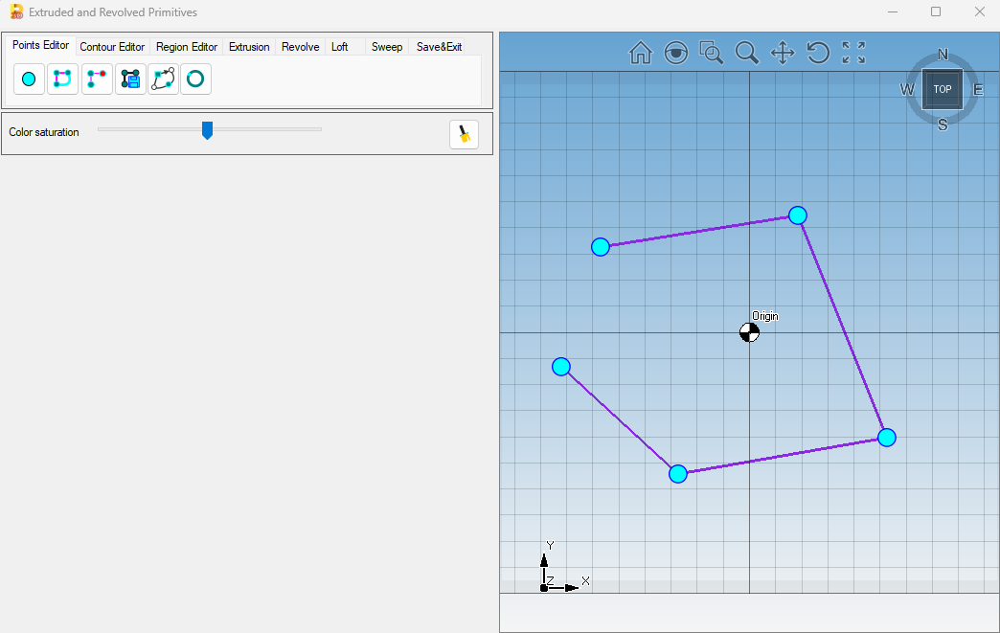
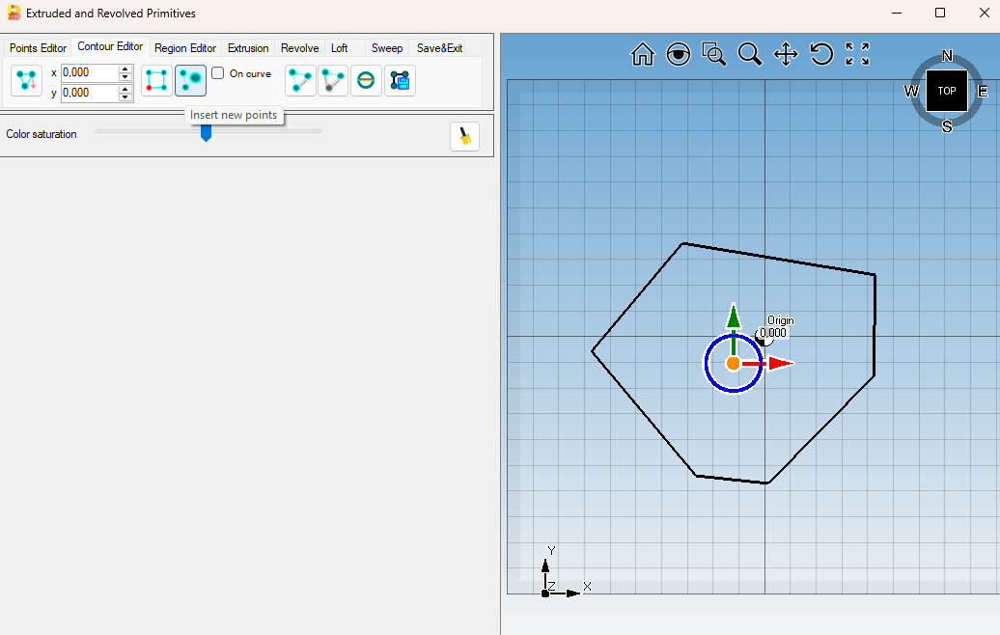
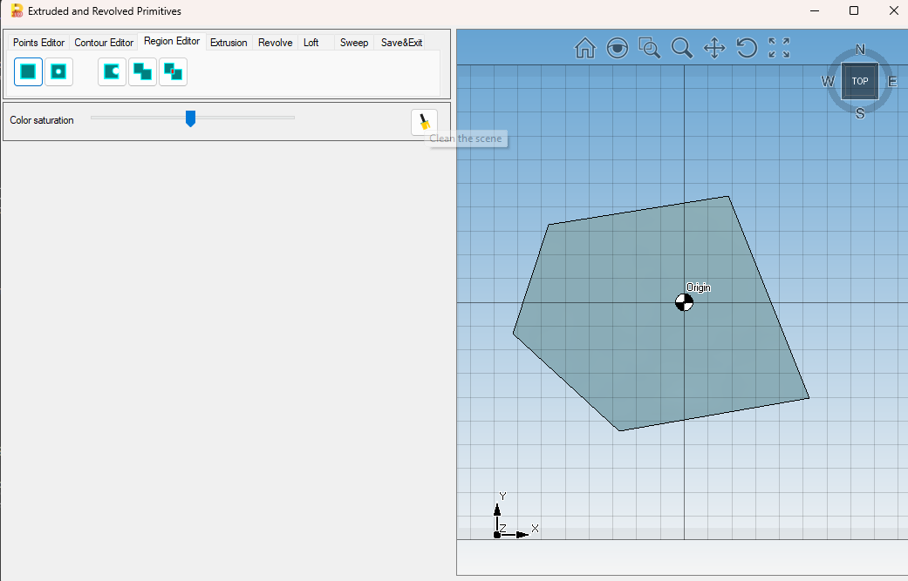
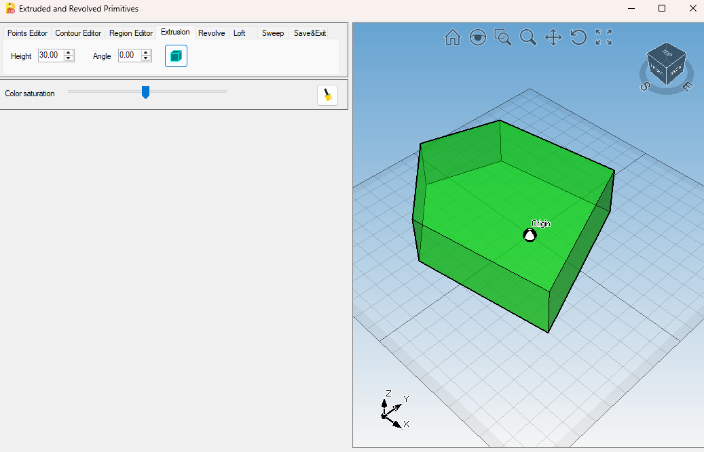
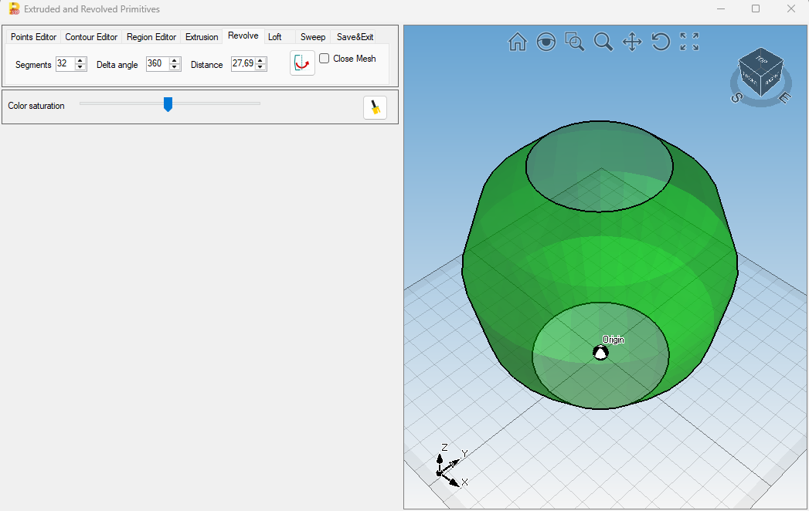
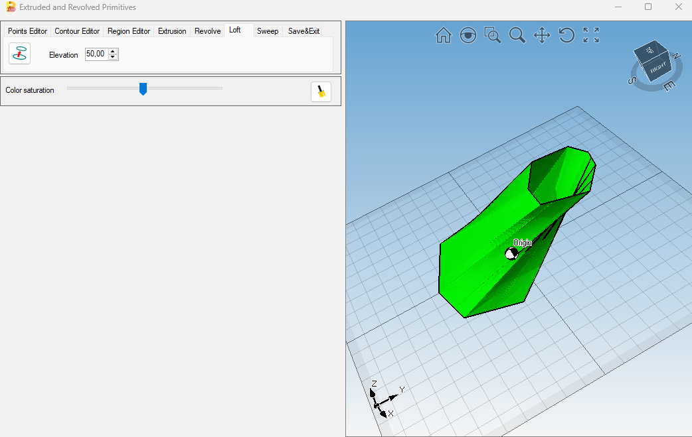
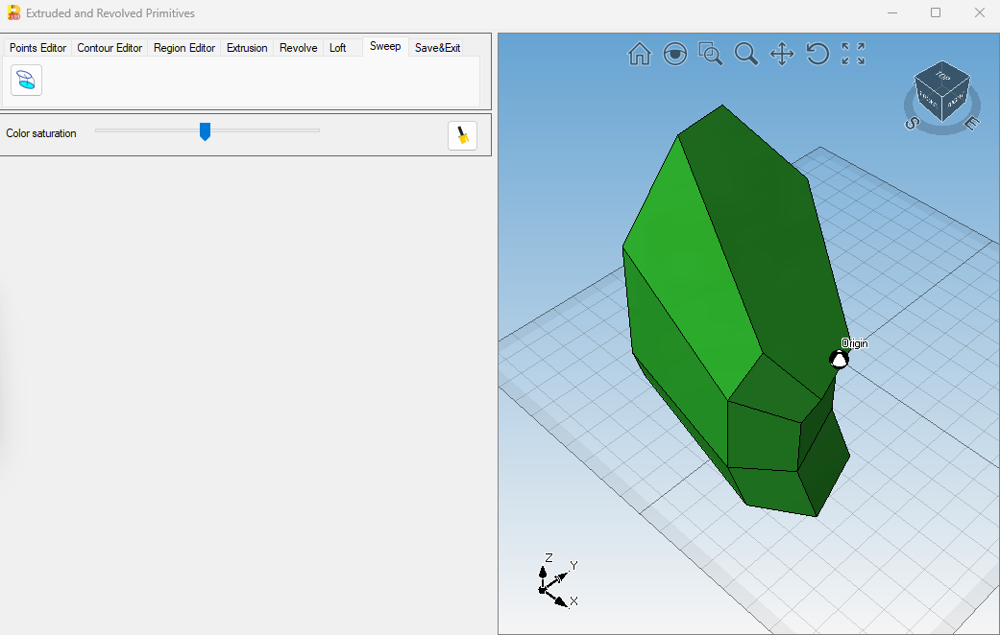

\# CAD/CAM Sketcher Prototype

This project is a C# WinForms prototype for creating custom 3D geometry based on 2D sketching workflows.

\## Features

\- Point creation and editing

\- Contour creation from points

\- Region creation from closed contours

\- Region boolean operations:

&#x20; - Union

&#x20; - Intersection

&#x20; - Difference

\- 3D geometry generation:

&#x20; - Extrusion

&#x20; - Revolve

&#x20; - Loft

\- STL export

\- Layer-based scene organization in Eyeshot

## Screenshots

### Points Editor

### Contour Editor

### Region Editor

### Extrusion Result

### Revolve Result

### Loft Result

### Sweep Result

The sweep function is currently implemented as a prototype and is still being tested.

## Architecture

The application separates geometry-processing logic from UI and scene-management logic.

### Main components

- **Form1**
  - Handles the WinForms user interface
  - Processes user actions and button events
  - Manages the Eyeshot viewport and scene updates
  - Adds, removes and updates entities in the model
  - Assigns colors, line weights and layers to visible objects

- **SketcherHelper**
  - Stores and processes sketch-related geometry
  - Manages points, contours and regions
  - Builds auxiliary lines and point labels
  - Creates regions from closed contours
  - Performs boolean operations on regions such as union, intersection and difference

### Scene structure

The Eyeshot `Model` control is used as the main 3D scene.

Entities are organized by layers:

- `AuxiliaryLayer`
- `ContourLayer`
- `RegionLayer`
- `DimLayer`
- `MeshLayer`
- `SplineLayer`

This layer-based structure makes it easier to manage visibility, styling and editing behavior.

### Geometry workflow

Typical workflow:

1. Create points
2. Build a contour from the points
3. Close and save the contour
4. Convert the contour into a region
5. Apply boolean region operations if required
6. Generate 3D geometry using extrusion, revolve, loft or sweep
7. Export the resulting geometry as STL

For a more detailed explanation, see [Architecture Documentation](docs/architecture.md).

\## Technologies

\- C#

\- .NET Framework 4.8

\- Windows Forms

\- devDept Eyeshot

\- Visual Studio 2022

\## Architecture

The project separates geometry logic from scene and UI logic.

\- `SketcherHelper` stores and processes points, contours and regions.

\- `Form1` handles user interaction, Eyeshot viewport events, layer assignment, entity display and scene updates.

## Build Requirements

To build and run this project, the following components are required:

- Windows
- Visual Studio 2022
- .NET Framework 4.8
- devDept Eyeshot
- A valid local Eyeshot license

This repository does not include commercial Eyeshot binaries, license files or license keys.

## How to Run

1. Clone the repository:

   `git clone https://github.com/schloenkin/cadcam-sketcher-eyeshot.git`

2. Open the solution file in Visual Studio:

   `Sketcher.sln`

3. Make sure that devDept Eyeshot is installed and available locally.

4. Add or configure your local Eyeshot license according to your own licensed installation.

5. Build and run the project in Visual Studio.

## Notes on Eyeshot

The project was developed with devDept Eyeshot as the CAD/CAM visualization and geometry-processing library.

Because Eyeshot is a commercial third-party component, this public repository only contains the application source code, documentation and screenshots.

\## License Notice

This repository does not include commercial Eyeshot binaries, license files or license keys.  

A valid local Eyeshot installation/license is required to build and run the project.

